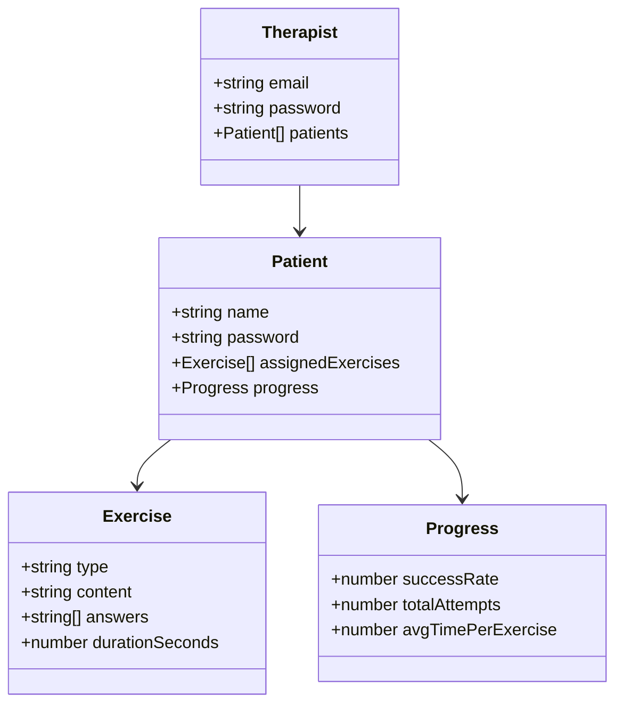
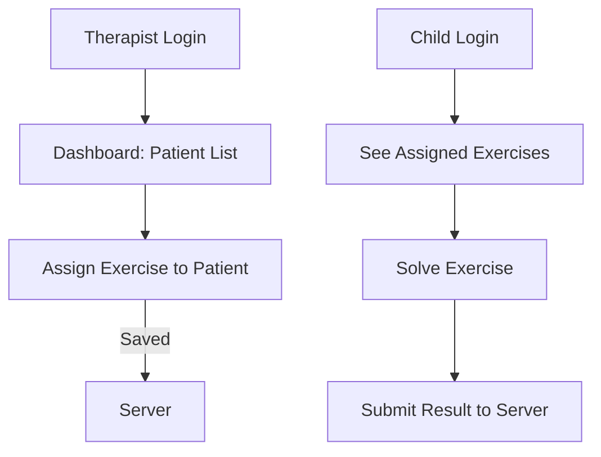

# 🧠 SpeechPlay — Web App for Language Therapy

A web-based platform for **speech-language pathologists** to assign and manage interactive language exercises for children.

Built with ❤️ by a former therapist turned developer.

---

## 👥 Users

- **Therapist**:
    - Login with email and password
    - Manage multiple patients
    - Assign custom exercises based on language difficulties

- **Child**:
    - Logs in with credentials
    - Completes fun language exercises (e.g., word sorting, sentence completion)
    - Progress tracked over time

---

## 🧱 Data Model

---

## 🧭 MVP User Flow

This MVP focuses on enabling:
- Therapists to log in, view patients, and assign exercises
- Children to log in, view their tasks, and submit results

---
~
## 🚧 MVP Roadmap

- [x] Define core entities (Therapist, Patient, Exercise, Progress)
- [x] Document system architecture with Mermaid diagrams
- [ ] Therapist login and dashboard
- [ ] Assign exercises to patients
- [ ] Child login and exercise view
- [ ] Store and display progress data

---

## 🛠️ Tech Stack (Planned)

- **Frontend**: React + TypeScript + MUI
- **Backend**: Express + Node.js
- **Validation**: Zod
- **AI-based exercise generator**: TBD (OpenAI or custom)

---

## ✨ Why this project?

Inspired by real-world clinical experience in speech-language therapy, this project combines domain knowledge and technical skill to make language learning more fun, personalized, and measurable.
